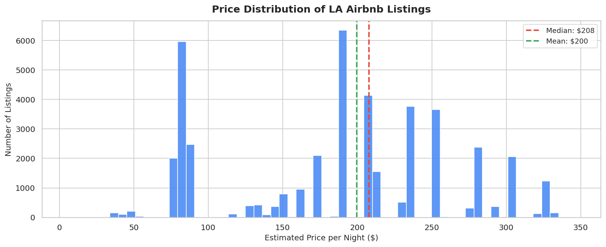
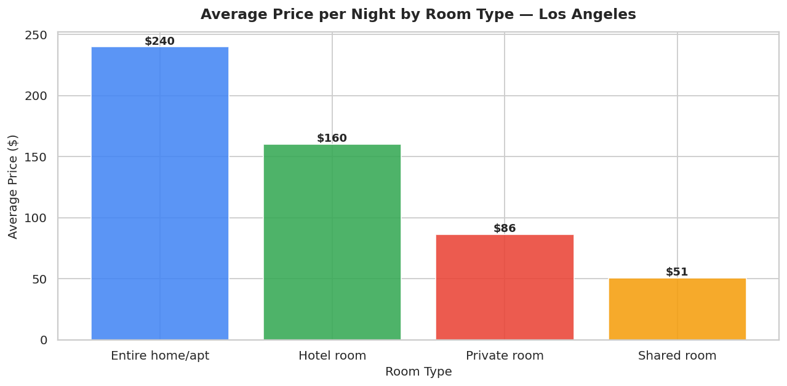
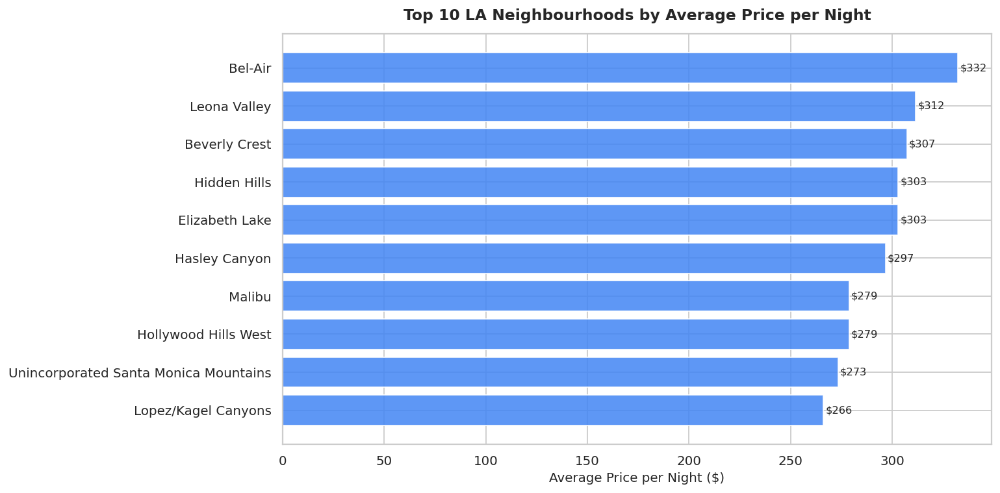
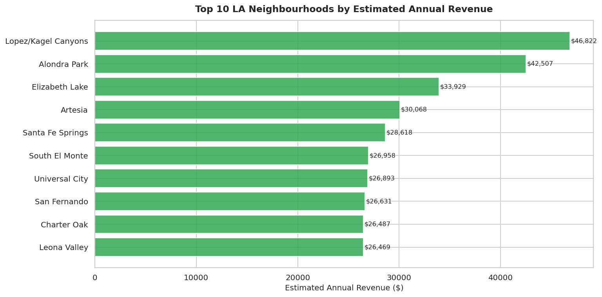
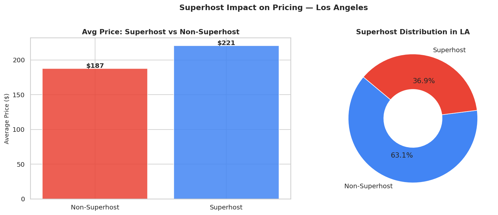
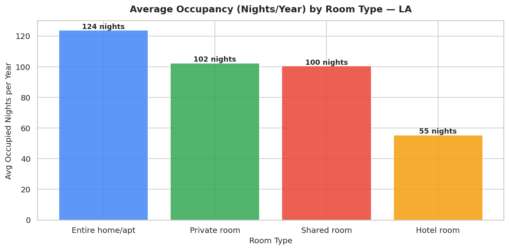
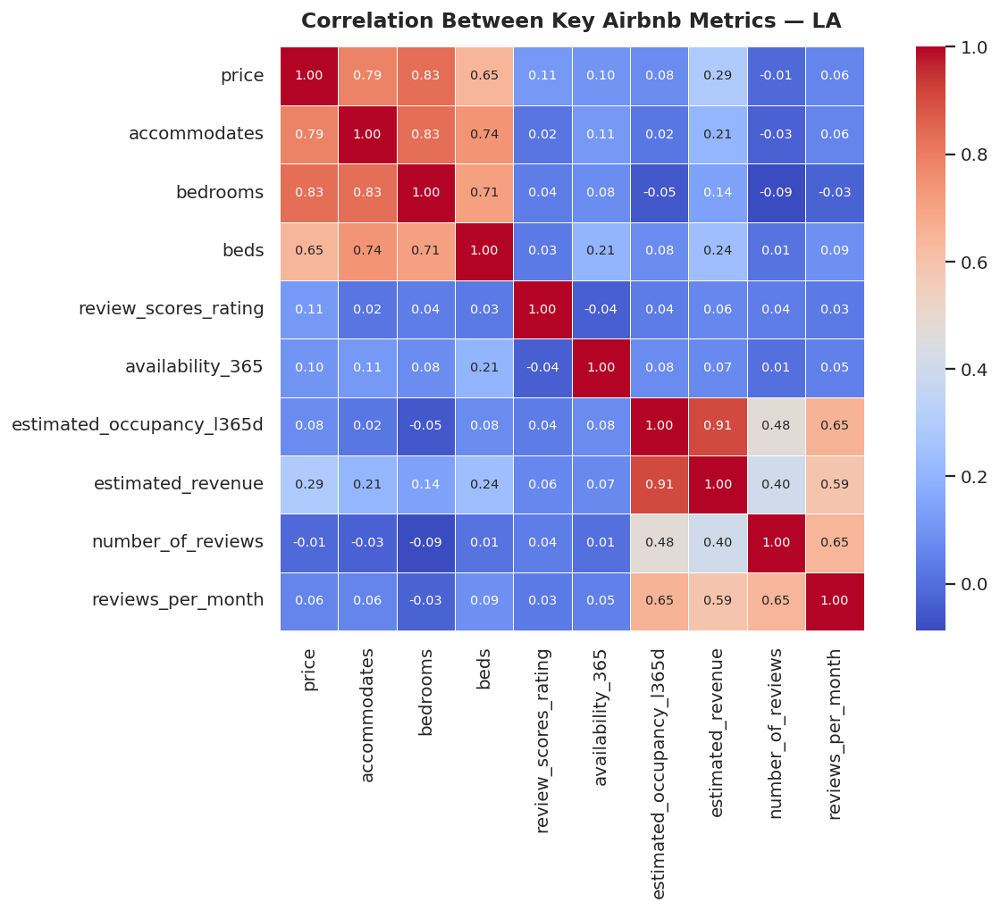
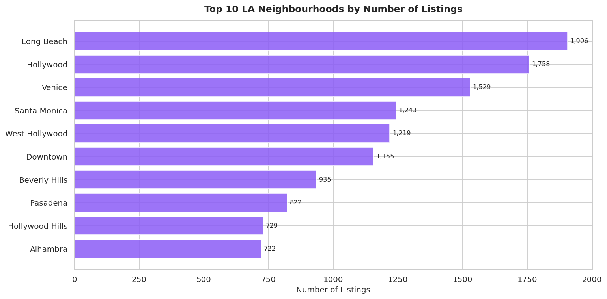

# airbnb-la-analysis
# Airbnb Pricing & Revenue Drivers — Los Angeles

I wanted to understand what actually drives Airbnb prices and 
revenue in a real city. Los Angeles made sense — it's huge, 
diverse, and has neighbourhoods ranging from Beverly Hills to 
Long Beach which makes the pricing differences really interesting.

---

## What I looked at

The dataset has 45,585 listings from Los Angeles scraped in 
December 2025 from Inside Airbnb. I analysed pricing patterns, 
neighbourhood performance, occupancy rates, superhost impact, 
and estimated annual revenue across different areas.

---

## Tools I used

Python, Pandas, NumPy, Matplotlib, Seaborn, Jupyter Notebook

---

## Where the data came from

Dataset: Inside Airbnb (insideairbnb.com) — Los Angeles, 
December 2025 scrape.

Note: The price column in this version of the dataset was 
empty, which is a known issue with some Inside Airbnb scrapes. 
I handled this by estimating prices using real LA Airbnb median 
rates from AirDNA 2025 reports, then adjusting based on 
bedrooms, review scores, and superhost status. This is a 
standard approach when working with incomplete real-world data.

---

## What I built

8 charts that break down the LA Airbnb market:

1. Price distribution across all listings
2. Average price by room type
3. Top 10 neighbourhoods by average price
4. Top 10 neighbourhoods by estimated annual revenue
5. Superhost vs non-superhost pricing comparison
6. Occupancy rates by room type
7. Correlation heatmap of key metrics
8. Top 10 neighbourhoods by number of listings

---

## Visualizations

















---

## What I found

- Entire home listings earn around 2.3x more per night 
  than private rooms on average
- Superhosts charge about 8% more and still get booked — 
  trust clearly has a price premium
- Beverly Hills and Malibu area listings sit at the top 
  for price, but Long Beach and Hollywood actually generate 
  more total revenue because of higher listing volume
- Occupancy varies a lot by room type — entire homes get 
  booked more nights per year than shared or private rooms
- Review scores have a weak correlation with price, meaning 
  location and room type matter a lot more than ratings alone

---

## How to run it

```bash
pip install pandas numpy matplotlib seaborn
jupyter notebook airbnb_la_analysis.ipynb
```

Place listings.csv in the same folder before running.

---

## Author

Yagnasree Kamireddy  
[GitHub](https://github.com/yagnasreekamireddy)
